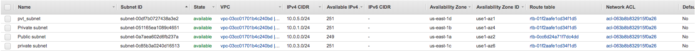
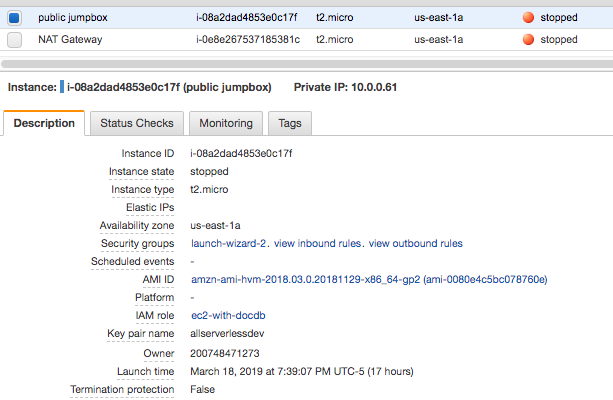
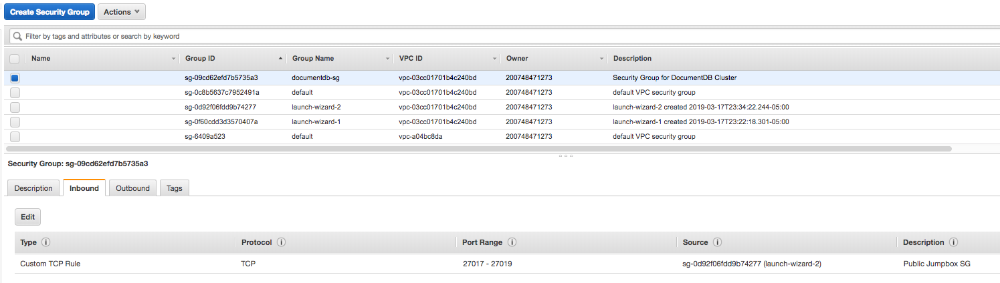

## 01. VPC Setup

1.  Create a VPC with at least 1 public subnet and at least 2 private subnets (https://console.aws.amazon.com/vpc/home)

    

2.  Create an EC2 instance to serve as a JumpBox and choose the public subnet. 

    *   Download the SSH key. You'll need it to connect to the instance
    *   Take note of the Security Group created for your instance

    

3.  Create a Security Group for DocumentDB

    * Add an Inbound "Custom TCP Rule" 
         *  Protocol: TCP 
         *  Port Range: 27017-27019 
         *  Source: EC2 Instance Security Group (see Step 2)
         
    