## 02. DocumentDB Setup

4.  Go to DocumentDB (https://console.aws.amazon.com/docdb/home)

    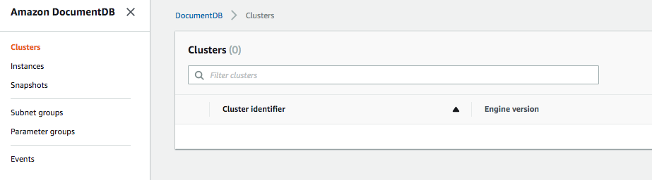

5.  Create a Subnet Group and add the private subnets.

    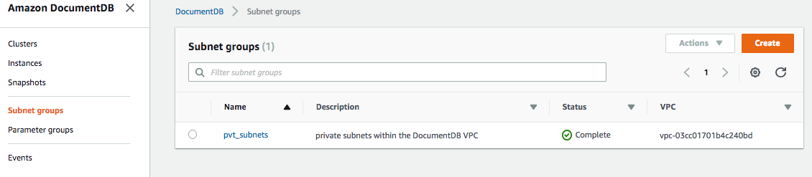

6.  Create a Parameter Group

    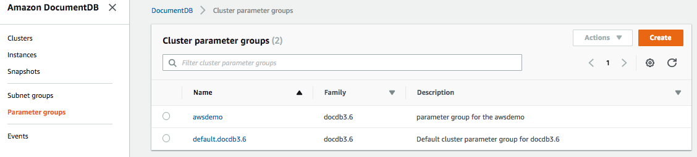

7.  Click on Clusters, then click on the Create button (far right)

    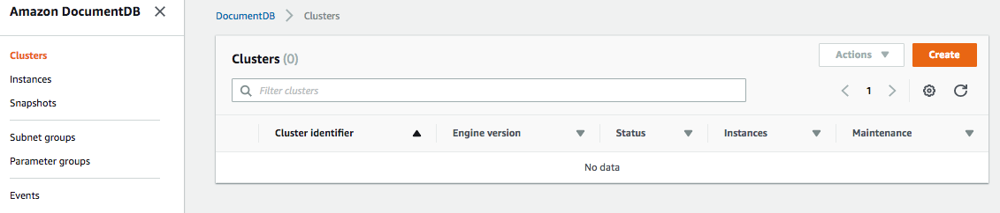

8.  **Configuration:** 

    * Choose a name (cluster identifier)
    * Choose your instance class (r4 types) (pricing at https://aws.amazon.com/ec2/pricing/on-demand/)
    * Choose the number of instances (minimum of three)

    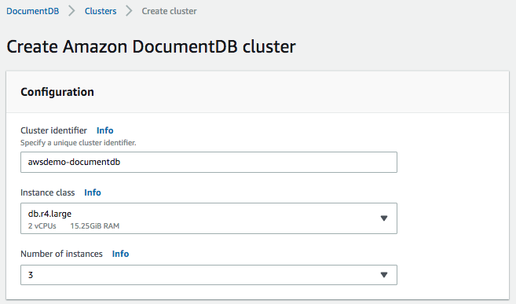

9.  **Authentication:**

    * Choose a Master username
    * Choose a Master password and confirm it
    
    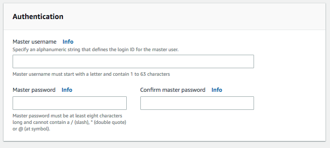
    
10. Click on Show Advanced Settings

    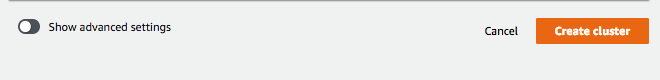

11. **Network Settings:**

    * Choose your VPC
    * Choose the Subnet Group you defined in Step 5
    * Choose the Security Group you defined in Step 3
    
    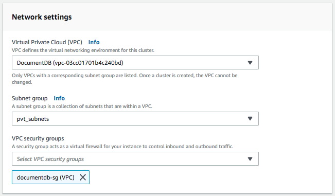

12. **Cluster Options:**
    
    * Choose the Parameter Group you defined in Step 6
    
    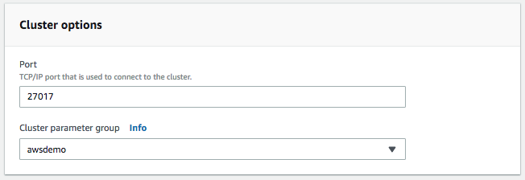
    
13. **Encryption-at-rest:**
    
    * Enable it and choose the KMS Key
    
    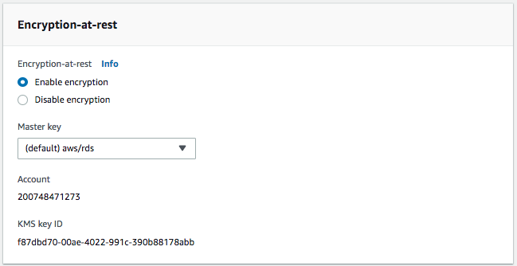
    
14. **Backup:**

    * Choose your backup retention period and backup window
    
    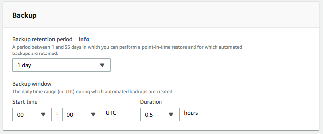
    
15. **Log Exports:**

    * Enable it if needed
    
    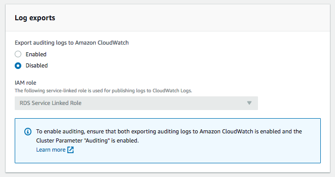
    
16. **Maintenance:**

    * Select your maintenance window
    
    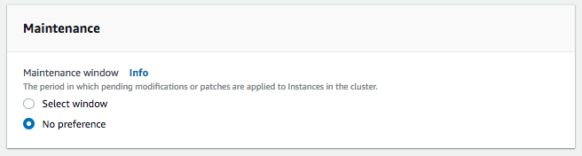
    
17. Click on the Create Cluster button

    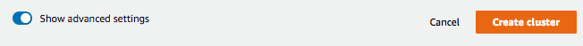

18. Wait for your cluster to be created... count to 100. If not created, repeat.

    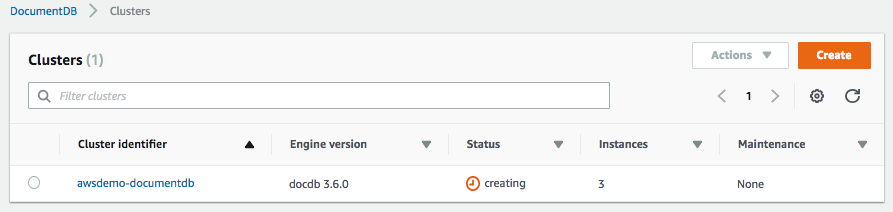

19. Take note of the **Connect** settings. You'll need them soon.

    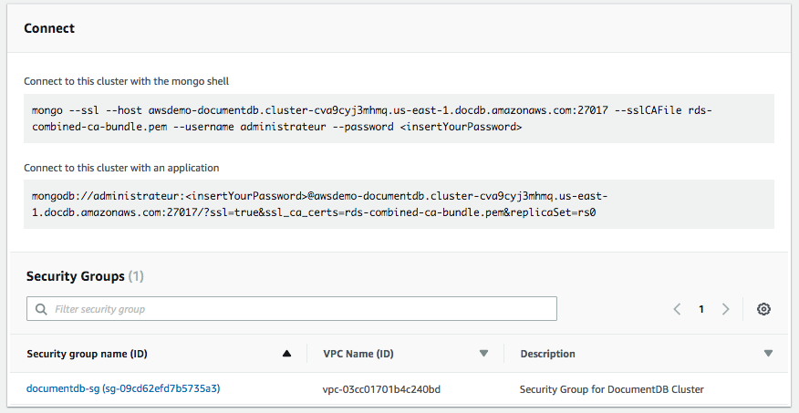
