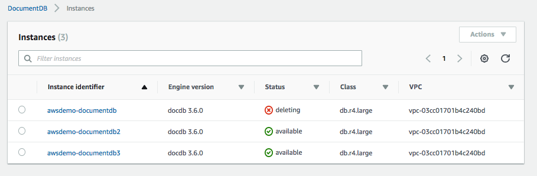
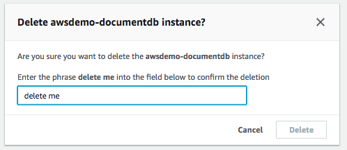
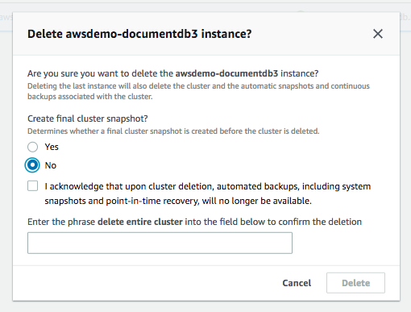

## 03. [Connecting to your DocumentDB cluster](03_connecting/connecting.md)

20. Make sure your EC2 instance (Step 2) is running

21. Create an SSH Tunnel to your EC2 instance

   ```
   ssh -i /Users/you/.ssh/YOUR_PVT_KEY -L 27017:HOST_NAME:27017 ec2-user@EC2_INSTANCE_IP_ADDRESS -N
   ```

22. Download the AWS RDS' key (https://s3.amazonaws.com/rds-downloads/rds-combined-ca-bundle.pem)

23. If using Java, do the following:

    * Add the AWS RDS key to your java keystore
      ``` 
      cd $JAVA_HOME/jre/lib/security
      sudo keytool -importcert -trustcacerts -file /path/to/rds-combined-ca-bundle.pem -keystore cacerts
      ```
      * default pwd is changeit
      
      * Sample Java code:
        
        ```
        MongoCredential mongoCredential = MongoCredential.createScramSha1Credential(USERNAME, "test", PASSWORD.toCharArray()); 
        credentials.add(mongoCredential);
        MongoClientOptions mongoClientOptions = MongoClientOptions.builder().sslInvalidHostNameAllowed(true).sslEnabled(true).build(); 
        ServerAddress serverAddress = new ServerAddress("localhost");
        mongoClient = new MongoClient(serverAddress, credentials, mongoClientOptions);
        ```

24. Install MongoDB via brew (https://docs.mongodb.com/manual/tutorial/install-mongodb-on-os-x/)

    * This will give you access to the Mongo Shell

25. Connect to the DocumentDB using the MongoDB shell

    *  mongo --sslAllowInvalidHostnames --ssl --sslCAFile /path/to/rds-combined-ca-bundle.pem --username USER_NAME --password PWD
    
26. Issue a few MongoDB commands

    ```
    use demo
    db.aws.insert({"firstName":"Peter","lastName":"Umbridge"})
    db.local.insert({"firstName":"Greg","lastName":"Pastorelli"})
    db.aws.find()
    db.aws.insert({"firstName":"Janet","lastName":"Tridd"})
    db.aws.find()
    ```
    
27. ### TEAR DOWN YOUR CLUSTER!!!

    * Go to Instances
    * Choose whether or not you want to create a final snapshot
    * Click the checkbox Acknowledgement that you want to delete the cluster
    * Type "delete entire cluster"

    
    
    